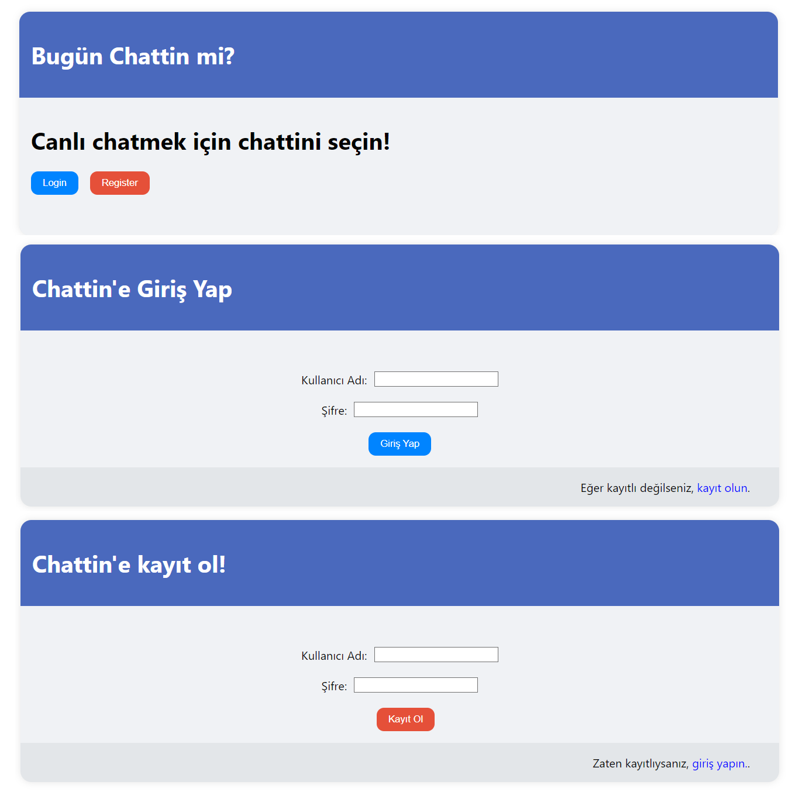
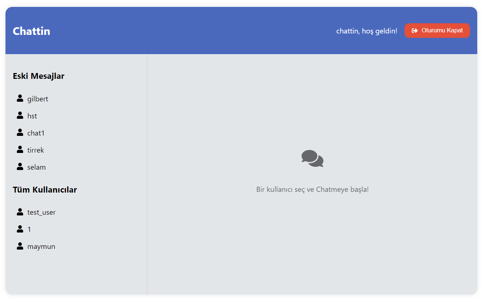
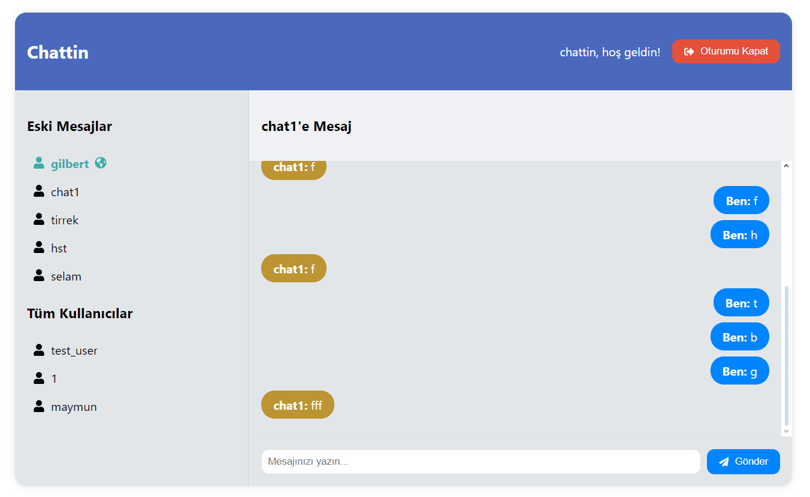

# Proje Adı: Chattin (English Below)

**Chattin Uygulaması**: Gerçek zamanlı mesajlaşma özelliğine sahip, kullanıcıların birbirleriyle iletişim kurmasını sağlayan bir uygulamadır.Javascript (React), CSS, Python (FastAPI) ve PostgreSQL ile geliştirilmiştir.

## Başlangıç

Bu bölüm, projeyi kendi bilgisayarınızda çalıştırabilmeniz için gerekli adımları içerir.

### Ekran Görüntüleri

#### Karşılama ekranları


#### Chat seçme ekranı


#### Mesaj geçmişi yok


#### Online kullanıcıları görüntülenmesi ve chat ekranı



### Gereksinimler

Projenin çalışması için aşağıdaki yazılımlar ve kütüphaneler gereklidir:

- Node.js (v18 veya üstü)
- Python (v3.7 veya üstü)
- FastAPI
- PostgreSQL
- WebSocket desteği

#### Frontend'de kullanılan Javascript ve IDE paketlerinin detaylı listesi:
- `axios`: HTTP istekleri yapmak için kullanılır.
- `react`: Kullanıcı arayüzü bileşenlerini oluşturmak için ana kütüphanedir.
- `react-dom`: React bileşenlerini DOM'a eklemek için kullanılır.
- `react-router-dom`: Tek sayfa uygulamalarında yönlendirme yapmak için kullanılır.
- `websocket`: WebSocket iletişimi için kullanılır.
- `dotenv`: Çevresel değişkenleri yönetmek için kullanılır.
- `concurrently`: Birden fazla komutu aynı anda çalıştırmak için kullanılır (örneğin, hem frontend hem de backend sunucusunu başlatmak için).
- `eslint`: Kod kalitesini artırmak için statik kod analizi yapar.
- `eslint-plugin-react`: React uygulamaları için özel ESLint kuralları sağlar.
- `prettier`: Kod biçimlendirmesi için kullanılır.

Bu kütüphaneleri `frontend` dizininde `package.json` dosyası olarak kaydedebilir ve ardından `npm install` komutunu çalıştırarak yükleyebilirsiniz.


#### Backend'de kullanılan Python paketlerinin detaylı listesi:
- `fastapi`: Web uygulamaları oluşturmak için asenkron bir framework.
- `uvicorn`: FastAPI uygulamalarını çalıştırmak için ASGI sunucusu.
- `sqlalchemy`: SQL veritabanları ile etkileşim kurmak için ORM.
- `pydantic`: Veri doğrulama ve ayarlama için kullanılır.
- `passlib`: Şifreleri güvenli bir şekilde hashlemek için.
- `python-jose`: JWT (JSON Web Tokens) oluşturma ve doğrulama için.
- `python-dotenv`: Çevre değişkenlerini yönetmek için.
- `cors`: Cross-Origin Resource Sharing (CORS) desteği sağlar.

Bu paketler `requirements.txt` dosyasında belirtilmiştir.


### Kurulum Adımları

1. **Depoyu Klonlayın**:
   ```bash
   git clone https://github.com/kullanici_adiniz/chat-app.git
   ```
   (Kendi GitHub kullanıcı adınızı kullanmayı unutmayın.)

2. **Frontend için Gerekli Bağımlılıkları Yükleyin**:
   ```bash
   cd chat-app/frontend
   npm install
   ```

3. **Backend için Gerekli Bağımlılıkları Yükleyin**:
   ```bash
   cd ../backend
   pip install -r requirements.txt
   ```

4. **Veritabanını Ayarlayın**:
   PostgreSQL'de bir veritabanı oluşturun ve gerekli tabloları oluşturmak için gerekli SQL dosyasını çalıştırın.

Aşağıdaki komutla yeni bir veritabanı oluşturun (örneğin, `chattin_db`):

    ```sql
    CREATE DATABASE chat_app;
    ```

#### **Kullanıcı Oluşturma ve Yetkilendirme**
Aşağıdaki komutla yeni bir kullanıcı oluşturun (örneğin, `chattin`):

    ```sql
    CREATE USER chattin WITH PASSWORD 'your_password';
    ```

Ardından, oluşturduğunuz kullanıcıya veritabanına erişim izni verin:

    ```sql
    GRANT ALL PRIVILEGES ON DATABASE chat_app TO chattin;
    ```

Veritabanınıza bağlandıktan sonra, gerekli tabloları oluşturmak için aşağıdaki SQL komutlarını kullanabilirsiniz:

#### **Kullanıcı Tablosu**
    ```sql
    CREATE TABLE users (
        id SERIAL PRIMARY KEY,
        username VARCHAR(50) UNIQUE NOT NULL,
        sent_messages INTEGER DEFAULT 0,
        received_messages INTEGER DEFAULT 0
    );
    ```

#### **Mesaj Tablosu**
    ```sql
    CREATE TABLE messages (
        id SERIAL PRIMARY KEY,
        sender_id INTEGER REFERENCES users(id),
        recipient_id INTEGER REFERENCES users(id),
        content TEXT NOT NULL,
        timestamp TIMESTAMP DEFAULT CURRENT_TIMESTAMP
    );
    ```

Oluşturduğunuz tabloları kontrol etmek için şu komutu kullanabilirsiniz:

    ```sql
    \dt
    ```


### Çalıştırma Adımları

1. **Backend Sunucusunu Başlatın**:
   ```bash
   cd chat-app/backend
   uvicorn main:app --reload
   ```

2. **Frontend Uygulamasını Başlatın**:
   ```bash
   cd chat-app/frontend
   npm start
   ```

3. Frontend için tarayıcınızda `http://localhost:3000` adresine gidin. Backend içinse `http://localhost:8000` adresine giderek karşılama mesajını görebilirsiniz. FastAPI'nin sağladığı Swagger arayüzüne `http://localhost:8000/docs` adresinden ulaşabilirsiniz.

Artık uygulamanız çalışıyor olmalı! 


### Kullanım

Projeyi kullanmaya başlamak için aşağıdaki adımları takip edin:

1. **Giriş Yapma**:
   - Uygulama açıldığında, giriş yapmanız gereken bir sayfa göreceksiniz.
   - Kayıtlı kullanıcı adı ve şifrenizi girin ve "Giriş" butonuna tıklayın.

2. **Kullanıcı Kaydı**:
   - Eğer henüz bir hesabınız yoksa, "Kayıt Ol" seçeneğine tıklayarak kullanıcı kaydı oluşturabilirsiniz.
   - Kullanıcı adınızı ve şifrenizi girin ve ardından "Kayıt" butonuna tıklayın.

3. **Mesaj Gönderme ve Alma**:
   - Giriş yaptıktan sonra, sol taraftaki kullanıcı listesinden bir kullanıcı seçin.
   - Seçtiğiniz kullanıcı ile mesajlaşmak için metin kutusuna mesajınızı yazın ve "Gönder" butonuna basın.
   - Mesajlar, seçtiğiniz kullanıcıyla olan sohbet penceresinde görüntülenecektir.
   - Şu an çevrimiçi olan kullanıcıları kalın yeşil fontla ve yanında bir dünya ikonu ile görebilirsiniz.
   - Daha önce mesajlaştığınız kullanıcılar `Eski Mesajlar` bölümünde, diğer kullanıcılar ise `Tüm Kullanıcılar` bölümünde görüntülenecektir.


### Özellikler

Proje aşağıdaki başlıca özelliklere sahiptir:

- Gerçek zamanlı mesajlaşma
- Kullanıcı kaydı ve giriş işlemleri
- Kullanıcı durumu görüntüleme (online/offline)
- Önceki mesajları görüntüleme
- Kullanıcı dostu arayüz


### Yapı

Projenin dizin yapısı şu şekildedir:

```
chattin-app/
├── backend/
│   ├── main.py               # FastAPI uygulama dosyası
│   ├── models.py             # Veritabanı modelleri
│   ├── schemas.py            # Veritabanı şemaları
│   ├── routes.py             # API yolları
│   └── requirements.txt       # Python bağımlılıkları
├── frontend/
│   ├── src/
│   │   ├── App.js            # Ana uygulama bileşeni
│   │   ├── Chat.js           # Sohbet bileşeni
│   │   ├── index.js          # Uygulama giriş noktası
│   │   └── ...               # Diğer bileşenler
│   └── package.json          # Node.js bağımlılıkları
└── README.md                 # Proje belgeleri
```

### Geliştirme

Projeyi geliştirmek isteyenler için aşağıdaki yönergeleri izleyebilirsiniz:

1. **Kod Değişiklikleri**:
   - Kodda değişiklik yapmak için `backend` ve `frontend` dizinlerinde gerekli dosyaları açın ve düzenleyin.

2. **Yeni Özellikler Eklemek**:
   - İstediğiniz yeni özellikleri eklemek için ilgili dosyaları düzenleyin ve test edin.

3. **Test Yazma**:
   - Yapılan değişiklikleri test etmek için uygun test dosyalarını oluşturun ve çalıştırın.

### Katkıda Bulunma Adımları

Projeye katkıda bulunmak için aşağıdaki adımları takip edebilirsiniz:

1. **Forklayın**: Projeyi GitHub'dan forklayın.
2. **Yeni Bir Branch Oluşturun**: Yeni özellikler veya düzeltmeleri kodu etkilemeden yapabilmek için bir dal oluşturun.
   ```bash
   git checkout -b yeni-ozellik
   ```
3. **Değişiklikleri Yapın**: Gerekli değişiklikleri yapın ve test edin.
4. **Değişiklikleri Yükleyin**: Değişikliklerinizi ana dalınıza geri yükleyin.
   ```bash
   git commit -m "Yeni özellik eklendi"
   git push origin yeni-ozellik
   ```
5. **Pull Request Gönderin**: GitHub'da ana depoya bir pull request gönderin.

### Lisans

Bu proje **MIT Lisansı** altında lisanslanmıştır. MIT Lisansı, yazılımın özgürce kullanılmasına, kopyalanmasına ve dağıtılmasına izin verir. Daha fazla bilgi için [Lisans Dosyası](LICENSE) dosyasına bakabilirsiniz.

### İletişim

Proje hakkında daha fazla bilgi veya katkıda bulunmak isterseniz, aşağıdaki iletişim bilgilerini kullanabilirsiniz:

- **E-posta**: isikmuhamm@gmail.com
- **GitHub**: [isikmuhamm](https://github.com/isikmuhamm)
- **Proje Sayfası**: [Proje URL'si](https://github.com/isikmuhamm/chattin)


--------------------------------------------------------------------------------------------------------------------------------


# Project Name: Chattin

**Chattin Application**: A real-time messaging app that allows users to communicate with each other. It was developed using JavaScript (React), CSS, Python (FastAPI), and PostgreSQL.

## Getting Started

This section outlines the steps needed to run the project on your local machine.

### Screenshots

#### Welcome screens


#### Chat selection screen


#### No message history


#### Displaying online users and chat screen


### Requirements

The following software and libraries are required for the project to work:

- Node.js (v18 or higher)
- Python (v3.7 or higher)
- FastAPI
- PostgreSQL
- WebSocket support

#### List of JavaScript and IDE packages used in the frontend:
- `axios`: Used for making HTTP requests.
- `react`: The main library for building user interface components.
- `react-dom`: Used to add React components to the DOM.
- `react-router-dom`: Used for routing in single-page applications.
- `websocket`: Used for WebSocket communication.
- `dotenv`: Used to manage environment variables.
- `concurrently`: Used to run multiple commands simultaneously (e.g., starting both the frontend and backend servers).
- `eslint`: Performs static code analysis to improve code quality.
- `eslint-plugin-react`: Provides specific ESLint rules for React applications.
- `prettier`: Used for code formatting.

You can save these libraries in the `package.json` file within the `frontend` directory and then run `npm install` to install them.


#### List of Python packages used in the backend:
- `fastapi`: An asynchronous framework for building web applications.
- `uvicorn`: An ASGI server for running FastAPI applications.
- `sqlalchemy`: An ORM for interacting with SQL databases.
- `pydantic`: Used for data validation and settings.
- `passlib`: Used for securely hashing passwords.
- `python-jose`: Used for creating and validating JWT (JSON Web Tokens).
- `python-dotenv`: Used for managing environment variables.
- `cors`: Provides Cross-Origin Resource Sharing (CORS) support.

These packages are listed in the `requirements.txt` file.


### Installation Steps

1. **Clone the Repository**:
   ```bash
   git clone https://github.com/your_username/chat-app.git
   ```
   (Make sure to use your own GitHub username.)

2. **Install Frontend Dependencies**:
   ```bash
   cd chat-app/frontend
   npm install
   ```

3. **Install Backend Dependencies**:
   ```bash
   cd ../backend
   pip install -r requirements.txt
   ```

4. **Set Up the Database**:
   Create a database in PostgreSQL and run the required SQL script to create the necessary tables.

Create a new database (e.g., `chattin_db`) with the following command:

    ```sql
    CREATE DATABASE chat_app;
    ```

#### **User Creation and Authorization**
Create a new user (e.g., `chattin`) with the following command:

    ```sql
    CREATE USER chattin WITH PASSWORD 'your_password';
    ```

Then grant access to the newly created user:

    ```sql
    GRANT ALL PRIVILEGES ON DATABASE chat_app TO chattin;
    ```

Once connected to your database, you can create the necessary tables using the following SQL commands:

#### **Users Table**
    ```sql
    CREATE TABLE users (
        id SERIAL PRIMARY KEY,
        username VARCHAR(50) UNIQUE NOT NULL,
        sent_messages INTEGER DEFAULT 0,
        received_messages INTEGER DEFAULT 0
    );
    ```

#### **Messages Table**
    ```sql
    CREATE TABLE messages (
        id SERIAL PRIMARY KEY,
        sender_id INTEGER REFERENCES users(id),
        recipient_id INTEGER REFERENCES users(id),
        content TEXT NOT NULL,
        timestamp TIMESTAMP DEFAULT CURRENT_TIMESTAMP
    );
    ```

You can verify the created tables with the following command:

    ```sql
    \dt
    ```


### Running the Project

1. **Start the Backend Server**:
   ```bash
   cd chat-app/backend
   uvicorn main:app --reload
   ```

2. **Start the Frontend Application**:
   ```bash
   cd chat-app/frontend
   npm start
   ```

3. For the frontend, navigate to `http://localhost:3000` in your browser. For the backend, you can see the welcome message at `http://localhost:8000`. The Swagger interface provided by FastAPI is available at `http://localhost:8000/docs`.

Your application should now be running!


### Usage

To start using the project, follow these steps:

1. **Log In**:
   - When the app opens, you'll see a login page.
   - Enter your registered username and password, and click the "Log In" button.

2. **Sign Up**:
   - If you don't have an account yet, click the "Sign Up" option to create one.
   - Enter your username and password, then click the "Register" button.

3. **Send and Receive Messages**:
   - Once logged in, select a user from the user list on the left.
   - To chat with the selected user, type your message in the text box and click the "Send" button.
   - Messages will appear in the chat window with the selected user.
   - Online users are displayed in bold green font with a globe icon next to their names.
   - Users you've previously chatted with will appear under the "Old Messages" section, while other users will be listed under the "All Users" section.


### Features

The project includes the following key features:

- Real-time messaging
- User registration and login
- Displaying user status (online/offline)
- Viewing previous messages
- User-friendly interface


### Structure

The directory structure of the project is as follows:

```
chattin-app/
├── backend/
│   ├── main.py               # FastAPI application file
│   ├── models.py             # Database models
│   ├── schemas.py            # Database schemas
│   ├── routes.py             # API routes
│   └── requirements.txt      # Python dependencies
├── frontend/
│   ├── src/
│   │   ├── App.js            # Main application component
│   │   ├── Chat.js           # Chat component
│   │   ├── index.js          # Application entry point
│   │   └── ...               # Other components
│   └── package.json          # Node.js dependencies
└── README.md                 # Project documentation
```

### Development

For those who want to develop the project, you can follow these instructions:

1. **Code Changes**:
   - To make code changes, open and edit the necessary files in the `backend` and `frontend` directories.

2. **Adding New Features**:
   - To add new features, edit the relevant files and test them.

3. **Writing Tests**:
   - Create and run appropriate test files to test any changes made.

### Contribution Steps

To contribute to the project, follow these steps:

1. **Fork the Project**: Fork the project from GitHub.
2. **Create a New Branch**: Create a branch to make your changes without affecting the main code.
   ```bash
   git checkout -b new-feature
   ```
3. **Make Changes**: Make and test the necessary changes.
4. **Push Changes**: Push your changes back to your branch.
   ```bash
   git commit -m "Added new feature"
   git push origin new-feature
   ```
5. **Submit a Pull Request**: Submit a pull request to the main repository on GitHub.

### License

This project is licensed under the **MIT License**. The MIT License allows free use, copying, and distribution of the software. For more information, see the [License File](LICENSE).

### Contact

For more information or to contribute to the project, you can contact me using the following details:

- **Email**: isikmuhamm@gmail.com
- **GitHub**: [isikmuhamm](https://github.com/isikmuhamm)
- **Project Page**: [Project URL](https://github.com/isikmuhamm/chattin)
