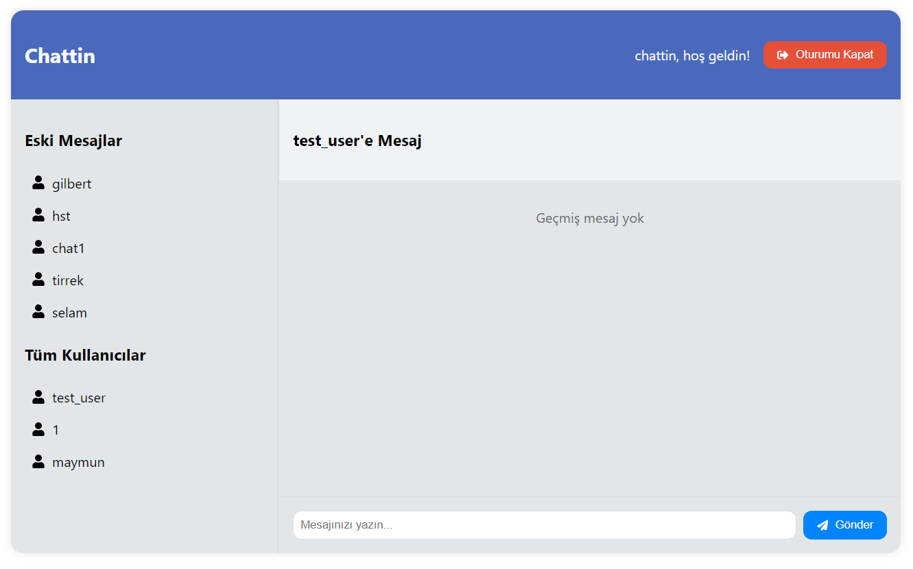

# Proje Adı: Chattin

**Chattin Uygulaması**: Gerçek zamanlı mesajlaşma özelliğine sahip, kullanıcıların birbirleriyle iletişim kurmasını sağlayan bir uygulamadır.Javascript (React), CSS, Python (FastAPI) ve PostgreSQL ile geliştirilmiştir.

## Başlangıç

Bu bölüm, projeyi kendi bilgisayarınızda çalıştırabilmeniz için gerekli adımları içerir.

### Ekran Görüntüleri





### Gereksinimler

Projenin çalışması için aşağıdaki yazılımlar ve kütüphaneler gereklidir:

- Node.js (v18 veya üstü)
- Python (v3.7 veya üstü)
- FastAPI
- PostgreSQL
- WebSocket desteği

#### Frontend'de kullanılan Javascript ve IDE paketlerinin detaylı listesi:
- `axios`: HTTP istekleri yapmak için kullanılır.
- `react`: Kullanıcı arayüzü bileşenlerini oluşturmak için ana kütüphanedir.
- `react-dom`: React bileşenlerini DOM'a eklemek için kullanılır.
- `react-router-dom`: Tek sayfa uygulamalarında yönlendirme yapmak için kullanılır.
- `websocket`: WebSocket iletişimi için kullanılır.
- `dotenv`: Çevresel değişkenleri yönetmek için kullanılır.
- `concurrently`: Birden fazla komutu aynı anda çalıştırmak için kullanılır (örneğin, hem frontend hem de backend sunucusunu başlatmak için).
- `eslint`: Kod kalitesini artırmak için statik kod analizi yapar.
- `eslint-plugin-react`: React uygulamaları için özel ESLint kuralları sağlar.
- `prettier`: Kod biçimlendirmesi için kullanılır.

Bu kütüphaneleri `frontend` dizininde `package.json` dosyası olarak kaydedebilir ve ardından `npm install` komutunu çalıştırarak yükleyebilirsiniz.


#### Backend'de kullanılan Python paketlerinin detaylı listesi:
- `fastapi`: Web uygulamaları oluşturmak için asenkron bir framework.
- `uvicorn`: FastAPI uygulamalarını çalıştırmak için ASGI sunucusu.
- `sqlalchemy`: SQL veritabanları ile etkileşim kurmak için ORM.
- `pydantic`: Veri doğrulama ve ayarlama için kullanılır.
- `passlib`: Şifreleri güvenli bir şekilde hashlemek için.
- `python-jose`: JWT (JSON Web Tokens) oluşturma ve doğrulama için.
- `python-dotenv`: Çevre değişkenlerini yönetmek için.
- `cors`: Cross-Origin Resource Sharing (CORS) desteği sağlar.

Bu paketler `requirements.txt` dosyasında belirtilmiştir.


### Kurulum Adımları

1. **Depoyu Klonlayın**:
   ```bash
   git clone https://github.com/kullanici_adiniz/chat-app.git
   ```
   (Kendi GitHub kullanıcı adınızı kullanmayı unutmayın.)

2. **Frontend için Gerekli Bağımlılıkları Yükleyin**:
   ```bash
   cd chat-app/frontend
   npm install
   ```

3. **Backend için Gerekli Bağımlılıkları Yükleyin**:
   ```bash
   cd ../backend
   pip install -r requirements.txt
   ```

4. **Veritabanını Ayarlayın**:
   PostgreSQL'de bir veritabanı oluşturun ve gerekli tabloları oluşturmak için gerekli SQL dosyasını çalıştırın.

Aşağıdaki komutla yeni bir veritabanı oluşturun (örneğin, `chattin_db`):

    ```sql
    CREATE DATABASE chat_app;
    ```

#### **Kullanıcı Oluşturma ve Yetkilendirme**
Aşağıdaki komutla yeni bir kullanıcı oluşturun (örneğin, `chattin`):

    ```sql
    CREATE USER chattin WITH PASSWORD 'your_password';
    ```

Ardından, oluşturduğunuz kullanıcıya veritabanına erişim izni verin:

    ```sql
    GRANT ALL PRIVILEGES ON DATABASE chat_app TO chattin;
    ```

Veritabanınıza bağlandıktan sonra, gerekli tabloları oluşturmak için aşağıdaki SQL komutlarını kullanabilirsiniz:

#### **Kullanıcı Tablosu**
    ```sql
    CREATE TABLE users (
        id SERIAL PRIMARY KEY,
        username VARCHAR(50) UNIQUE NOT NULL,
        sent_messages INTEGER DEFAULT 0,
        received_messages INTEGER DEFAULT 0
    );
    ```

#### **Mesaj Tablosu**
    ```sql
    CREATE TABLE messages (
        id SERIAL PRIMARY KEY,
        sender_id INTEGER REFERENCES users(id),
        recipient_id INTEGER REFERENCES users(id),
        content TEXT NOT NULL,
        timestamp TIMESTAMP DEFAULT CURRENT_TIMESTAMP
    );
    ```

Oluşturduğunuz tabloları kontrol etmek için şu komutu kullanabilirsiniz:

    ```sql
    \dt
    ```


### Çalıştırma Adımları

1. **Backend Sunucusunu Başlatın**:
   ```bash
   cd chat-app/backend
   uvicorn main:app --reload
   ```

2. **Frontend Uygulamasını Başlatın**:
   ```bash
   cd chat-app/frontend
   npm start
   ```

3. Frontend için tarayıcınızda `http://localhost:3000` adresine gidin. Backend içinse `http://localhost:8000` adresine giderek karşılama mesajını görebilirsiniz. FastAPI'nin sağladığı Swagger arayüzüne `http://localhost:8000/docs` adresinden ulaşabilirsiniz.

Artık uygulamanız çalışıyor olmalı! 


### Kullanım

Projeyi kullanmaya başlamak için aşağıdaki adımları takip edin:

1. **Giriş Yapma**:
   - Uygulama açıldığında, giriş yapmanız gereken bir sayfa göreceksiniz.
   - Kayıtlı kullanıcı adı ve şifrenizi girin ve "Giriş" butonuna tıklayın.

2. **Kullanıcı Kaydı**:
   - Eğer henüz bir hesabınız yoksa, "Kayıt Ol" seçeneğine tıklayarak kullanıcı kaydı oluşturabilirsiniz.
   - Kullanıcı adınızı ve şifrenizi girin ve ardından "Kayıt" butonuna tıklayın.

3. **Mesaj Gönderme ve Alma**:
   - Giriş yaptıktan sonra, sol taraftaki kullanıcı listesinden bir kullanıcı seçin.
   - Seçtiğiniz kullanıcı ile mesajlaşmak için metin kutusuna mesajınızı yazın ve "Gönder" butonuna basın.
   - Mesajlar, seçtiğiniz kullanıcıyla olan sohbet penceresinde görüntülenecektir.
   - Şu an çevrimiçi olan kullanıcıları kalın yeşil fontla ve yanında bir dünya ikonu ile görebilirsiniz.
   - Daha önce mesajlaştığınız kullanıcılar `Eski Mesajlar` bölümünde, diğer kullanıcılar ise `Tüm Kullanıcılar` bölümünde görüntülenecektir.


### Özellikler

Proje aşağıdaki başlıca özelliklere sahiptir:

- Gerçek zamanlı mesajlaşma
- Kullanıcı kaydı ve giriş işlemleri
- Kullanıcı durumu görüntüleme (online/offline)
- Önceki mesajları görüntüleme
- Kullanıcı dostu arayüz


### Yapı

Projenin dizin yapısı şu şekildedir:

```
chattin-app/
├── backend/
│   ├── main.py               # FastAPI uygulama dosyası
│   ├── models.py             # Veritabanı modelleri
│   ├── schemas.py            # Veritabanı şemaları
│   ├── routes.py             # API yolları
│   └── requirements.txt       # Python bağımlılıkları
├── frontend/
│   ├── src/
│   │   ├── App.js            # Ana uygulama bileşeni
│   │   ├── Chat.js           # Sohbet bileşeni
│   │   ├── index.js          # Uygulama giriş noktası
│   │   └── ...               # Diğer bileşenler
│   └── package.json          # Node.js bağımlılıkları
└── README.md                 # Proje belgeleri
```

### Geliştirme

Projeyi geliştirmek isteyenler için aşağıdaki yönergeleri izleyebilirsiniz:

1. **Kod Değişiklikleri**:
   - Kodda değişiklik yapmak için `backend` ve `frontend` dizinlerinde gerekli dosyaları açın ve düzenleyin.

2. **Yeni Özellikler Eklemek**:
   - İstediğiniz yeni özellikleri eklemek için ilgili dosyaları düzenleyin ve test edin.

3. **Test Yazma**:
   - Yapılan değişiklikleri test etmek için uygun test dosyalarını oluşturun ve çalıştırın.

### Katkıda Bulunma Adımları

Projeye katkıda bulunmak için aşağıdaki adımları takip edebilirsiniz:

1. **Forklayın**: Projeyi GitHub'dan forklayın.
2. **Yeni Bir Branch Oluşturun**: Yeni özellikler veya düzeltmeleri kodu etkilemeden yapabilmek için bir dal oluşturun.
   ```bash
   git checkout -b yeni-ozellik
   ```
3. **Değişiklikleri Yapın**: Gerekli değişiklikleri yapın ve test edin.
4. **Değişiklikleri Yükleyin**: Değişikliklerinizi ana dalınıza geri yükleyin.
   ```bash
   git commit -m "Yeni özellik eklendi"
   git push origin yeni-ozellik
   ```
5. **Pull Request Gönderin**: GitHub'da ana depoya bir pull request gönderin.

### Lisans

Bu proje **MIT Lisansı** altında lisanslanmıştır. MIT Lisansı, yazılımın özgürce kullanılmasına, kopyalanmasına ve dağıtılmasına izin verir. Daha fazla bilgi için [Lisans Dosyası](LICENSE) dosyasına bakabilirsiniz.

### İletişim

Proje hakkında daha fazla bilgi veya katkıda bulunmak isterseniz, aşağıdaki iletişim bilgilerini kullanabilirsiniz:

- **E-posta**: isikmuhamm@gmail.com
- **GitHub**: [isikmuhamm](https://github.com/isikmuhamm)
- **Proje Sayfası**: [Proje URL'si](https://github.com/isikmuhamm/chattin)